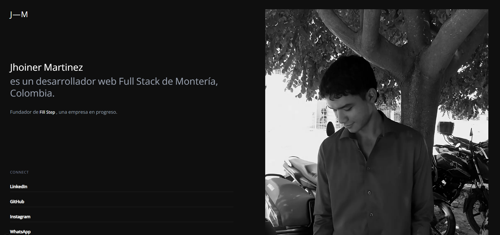

# Portfolio Personal

¡Bienvenido a mi portfolio personal! 🚀

Este proyecto es una aplicación web desarrollada con [Next.js](https://nextjs.org/) que muestra mis proyectos, habilidades y formas de contactarme. Es un espacio donde comparto mi experiencia profesional y algunos de los trabajos que he realizado.

## Demo



> Puedes ver la demo en: [https://tu-dominio.com](https://tu-dominio.com) <!-- Reemplaza este enlace por el de tu despliegue -->

## Tecnologías utilizadas

- [Next.js](https://nextjs.org/)
- [React](https://react.dev/)
- [TypeScript](https://www.typescriptlang.org/)
- [Tailwind CSS](https://tailwindcss.com/) (si aplica)
- [Vercel](https://vercel.com/) para despliegue

## Instalación y uso

1. Clona el repositorio:
   ```bash
   git clone https://github.com/tu-usuario/portfolio.git
   cd portfolio
   ```
2. Instala las dependencias:
   ```bash
   pnpm install # o npm install, yarn install, bun install
   ```
3. Inicia el servidor de desarrollo:
   ```bash
   pnpm dev # o npm run dev, yarn dev, bun dev
   ```
4. Abre [http://localhost:3000](http://localhost:3000) en tu navegador.

## Estructura del proyecto

```
portfolio/
  ├─ public/           # Imágenes y archivos estáticos
  ├─ src/
  │   ├─ app/          # Páginas y layout principal
  │   ├─ components/   # Componentes reutilizables
  │   └─ lib/          # Utilidades y helpers
  ├─ package.json      # Dependencias y scripts
  └─ ...
```

## Autor

- **Jhoiner Martinez**  
  [LinkedIn](https://linkedin.com/in/tuusuario) | [Twitter](https://twitter.com/tuusuario) | [Email](mailto:tuemail@dominio.com)

---

¡Gracias por visitar mi portfolio! Si tienes alguna sugerencia o quieres contactarme, no dudes en hacerlo.
